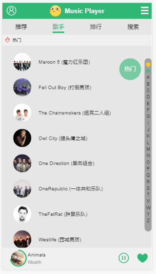

# Music Player

> 基于Vue的音乐播放器

  <a href="https://github.com/vuejs/vue"></a>
  <a href="https://github.com/vuejs/vue-router"></a>
  <a href="https://github.com/vuejs/vuex"></a>
  <a href="https://github.com/hilongjw/vue-lazyload"></a>
  
  <a href="https://github.com/axios/axios"></a>
  <a href="https://github.com/ustbhuangyi/better-scroll"></a>
  <a href="https://github.com/ftlabs/fastclick"></a>
  <a href="https://github.com/stylus/stylus"></a>

### 一、播放器基本功能
- [x] 歌曲播放、切歌、进度控制
- [x] 三种播放模式的切换
- [x] 搜索歌手、歌曲

### 二、概述
- 上面图片可以看出，有许多页面采用了复用的组件，比如推荐歌单页（图2）、歌手详情页（图4）、排行榜详情页（图8），同时在这些组件中还有更加细分的基础组件。这样可以高度定制化组件，满足不同的需求，提高开发效率。
- 这个demo依然有许多隐藏的bug，还有许多功能待完善，我也会一直更新完善这个demo。

### 三、图片预览
- 1.首页

- 2.推荐歌单页

- 3.歌手页

- 4.歌手详情页

- 5.播放器


- 6.排行榜

- 7.排行榜详情页

- 8.搜索页

- 9.搜索结果


### 四、主要问题及解决方式

**起步**：

Init the project by vue-cli(installed the dependencies by cnpm)，and install babel-polyfill in dev-environment in order to compile es6'api(Array.from(),Object.assign()...) to javascript, also, installed babel-runtime and fastclick in pro-environment which the latter one is provided to solve "300ms delay" in mobile. 

**问题清单**:

I got many troubles in doing this project,and now i would list them to remind me that i shoudn't be struggled in the same troubles again.
##### Q1:

> * To obtain the data of QQ music, i need to use jsonp,but there is no way to get a more friendly API on GitHub, So i considered to create a more friendly API of JSONP:
```javascript
    import originJsonp from 'jsonp'
//based on https://github.com/webmodules/jsonp
export default function jsonp(url, data, option) {
  url += (url.indexOf('?') < 0 ? '?' : '&') + param(data)

  return new Promise((resolve, reject) => {
    originJsonp(url, option, (err, data) => {
      if (!err) {
        resolve(data)
      } else {
        reject(err)
      }
    })
  })
}

export function param(data) {
  let url = ''
  for (var k in data) {
    let value = data[k] !== undefined ? data[k] : ''
    url += '&' + k + '=' + encodeURIComponent(value)
  }
  return url ? url.substring(1) : ''
}
```
##### Q2:
> * I use better-scroll to build my slider component,but the first question i found was that the slider component can't be rendered rightly.this problem was caused by :the slider component has been mounted before got the silder data with JSONP(async progress). so, in recommend component i need to add a judgment:
```html
<!-- 获取图片数据是异步的，拿到数据前slider组件已经被mounted，不能正确渲染，需要如下判断 -->
<!--recommends.length表示是否获取到数据-->
   	<div v-if="recommends.length" class="slider-wrapper">
   		<slider>
   			<div v-for="item in recommends">
   				<a :href="item.linkUrl">
   					
   				</a>
   			</div>
   		</slider>
   	</div>
```
##### Q3:
> * When import function that exported from recommend.js, it shows: `TypeError: Object(...) is not a function`,so i changed the way to export by not using `default`,and divide the functions into 2 js files,and troubles was dealed
##### Q4:
> * When i got data of singers by JSONP,i found that the Data structure wasn't what i need. So i have to transform the structure by a series of ways into a two-dimensional Array. To be honest,it tooks me a lots of time,but any way,it deservered.
##### Q5:
> * When i click the buttons of nextSong and prevSong to switch the currentSong,it shows error:`vue.runtime.esm.js?b7b3:6240 Uncaught (in promise) DOMException: The play() request was interrupted by a new load request`.I found that it's because the source of the song was not ready,so i designed an onoff to promise the songs can be played only when it's src is loaded,like this:
```html
<!--媒体标签的自带方法-->
<audio ref="audio" :src="currentSong.url" @canplay="canplay" @error="error" @timeupdate="_currentTime"></audio>
```
```js
canplay(){  //标识：歌曲canplay时置为true
    this.canBePlayed = true
},
error(){  //防止加载歌曲出错时播放器挂起
    this.canBePlayed = true
}

nextSong(){
    if( !this.canBePlayed ) { return }

    let index = this.currentIndex + 1
    if( index === -1 ) { index = this.playList.length - 1 }
    this.setCurrentIndex(index) 

    this.canBePlayed = false 
}
```
##### Q7:
> * 由于QQ音乐请求头的限制，不能直接通过JSONP获取歌词数据，我采用后端代理来获取

- 1.首先，对获取歌词数据的方法做出修改
```js
//获取数据的文件
import axios from 'axios'
import {commonParams, options} from './config'
export default function getLyric(mid){
    //把正常请求的地址换为约定的后端代理地址
    const url = '/api/getLyric'
	// 把公共参数和其他参数合并
	const data = Object.assign( {}, commonParams, {
		pcachetime: + new Date() ,
		songmid: mid,
		g_tk: 5381,
		loginUin: 0,
		hostUin: 0,
		format: 'json',
		platform:' yqq',
		needNewCode: 0
	})
	return axios.get( url, {
		params: data
	} ).then( (res) => {
		return Promise.resolve( res.data )
	} )
}
```
- 2.在webpack-dev-conf.js中添加以下逻辑即可
```js
let express = require('express')
let axios = require('axios')
let app = express()
let apiRoutes = express.Router()
app.use('/api', apiRoutes)
//找到devServer后在里面添加以下内容
    before(app){
      app.get( '/api/getLyric', function(req, res) {
      //这里是正常请求的地址
        const url = 'https://c.y.qq.com/lyric/fcgi-bin/fcg_query_lyric_new.fcg'
        //通过axios在nodejs中发送HTTP请求时，带上指定的headers以及params
        axios.get( url, {
          headers: {
            referer: 'https://y.qq.com/',
            host: 'c.y.qq.com'
          },
          params: req.query
        } ).then((response) => {
          // res.json(response.data)
          //得到的歌词数据是JSONP形式，需要将其转为JSON
          var ret = response.data
          if (typeof ret === 'string') {
            var reg = /^\w+\(({[^()]+})\)$/
            var matches = ret.match(reg)
            if (matches) {
              ret = JSON.parse(matches[1])
            }
          }
          res.json(ret)
        } ).catch((err) => {
          console.log(err)
        })
      } )
```
##### Q8:
> * During developing the search component, i met a trouble that: it can't send request when i enter the character in input first time Whether the character is a letter or a singer word. And then i found it was caused by the props:
```html
<!--<div class="hotkey-wrapper" v-if="!searchTxt">-->
<div class="hotkey-wrapper" v-show="!searchTxt">
<div class="shortcut">
	<div class="hotkey">
		<i class="icon-huo"></i>
			<h1 class="title">热门搜索</h1>
				<ul>
					<li @click="selectItem(item.k, index)" class="item" 
							v-for="item,index in hotKey"				:class="{hightLight: index === 0}"
						>{{item.k}}</li>
				</ul>
			</div>
		</div>
	</div>
<!--<div class="search-result" v-else>-->
<div class="search-result" v-show="searchTxt">
	<result :searchTxt="searchTxt"></result>
</div>
```
**The key problem was that i used v-if and v-else ,by the first time i entered the character, the `<div class="search-result"></div>` just created but it coundn't pass the props to `result component` unless entering the next time.**

